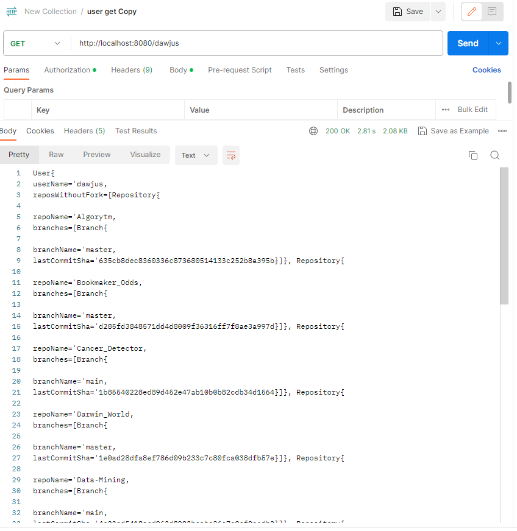
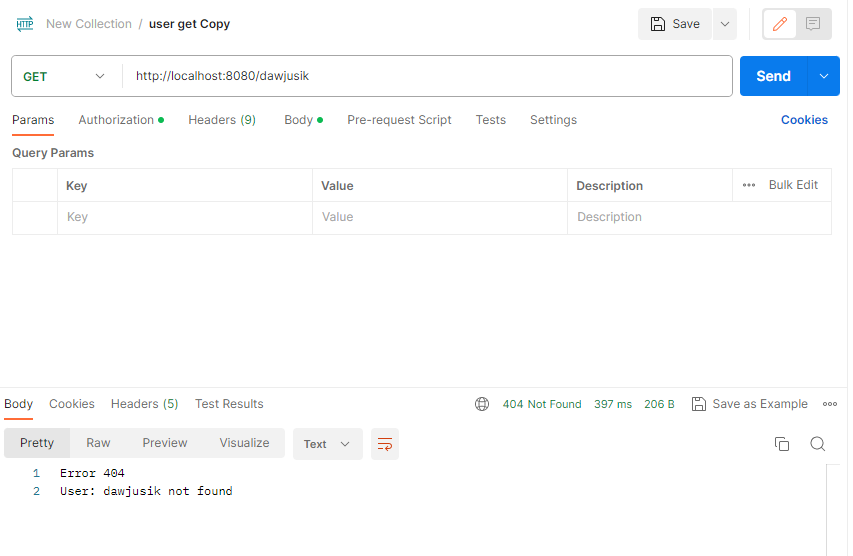

# GitHubApi
Recruitment task

1. Add endpoint /{UserName}  
a) if user exists it will show his unforked repositories and branches  

  

b) if the user does not exist, a message will be displayed  

  

